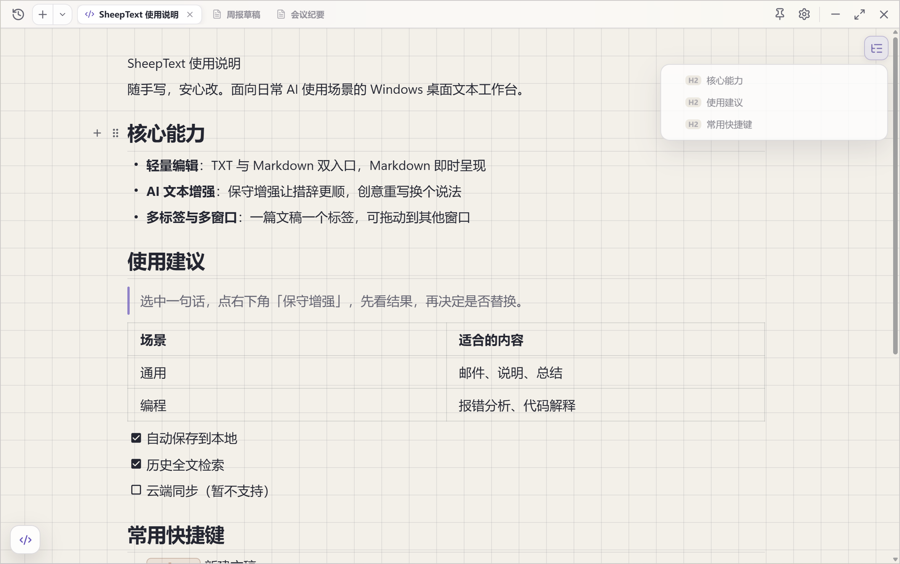
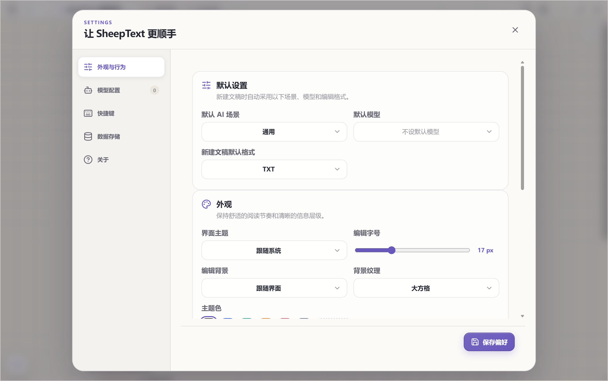

# SheepText

SheepText 是一款面向日常 AI 使用场景的 Windows 桌面文本工作台。以轻量编辑为核心，提供 AI 文本增强、即时呈现 Markdown、多标签与多窗口、本地文件编辑、历史检索、贴边收起和托盘驻留等能力。

当前版本：`0.4.1`



## 主要能力

### 编辑

- **TXT 与 Markdown 双入口**：TXT 使用 CodeMirror；Markdown 直接进入所见即所得的 Milkdown/Crepe 编辑器，无需在源码、分栏、预览之间来回切换。
- **Markdown 完整能力**：斜杠菜单、块拖动、选区格式工具栏、标题、引用、列表、任务列表、链接、表格、代码块、公式与图片。
- **文档大纲**：右上角悬浮展开，按真实标题层级列出，点击即可跳转；也可固定常驻。
- **查找替换**：非模态查找浮层，支持正则、全选匹配、匹配计数与行号标记，关闭时自动清除高亮。
- **粘贴格式选择**：粘贴后出现「保留原格式 / 清除格式」临时操作区，清除格式会把 Markdown 标记还原成纯正文。
- **图片粘贴**：可直接粘贴剪贴板图片，按文稿复制到应用数据目录并使用随机文件名。
- **快捷键**：`Ctrl + N` 新建文稿、`Ctrl + T` 新建标签、`Ctrl + W` 关闭标签、`Ctrl + F` 查找替换、`Ctrl + D` 复制本行到下一行、`Ctrl + Tab` 切换标签、`Ctrl + 鼠标滚轮` 调整字号。
- 中文输入法友好：输入法提交时打断撤销分组，`Ctrl + Z` 每次只回退一次提交，不会一次清掉整段。

### 文稿组织

- **多标签标题栏**：一个窗口内可同时打开多篇文稿，标签显示文件名或正文首行。
- **标签拖动**：可调整顺序，可跨窗口拖动（按落点插入或追加到末尾），也可拖出成独立窗口。
- **标签上限**：单窗口最多 8 个标签，超出时自动在新窗口打开并提示。
- **多窗口**：支持 `Ctrl + Shift + N` 新建窗口，每个窗口独立调整尺寸与位置。
- **历史检索**：抽屉式文稿库，显示开头摘要与时间，支持全文关键字搜索与滚动懒加载。
- **会话恢复**：重启或从托盘恢复时，还原上次会话的全部窗口及其标签。

### 本地文件

- 直接打开本地 TXT / Markdown 文件编辑，改动实时同步保存回磁盘。
- 支持文件关联（双击 `.md` / `.txt` 用 SheepText 打开）与拖放文件打开；拖入文件优先作为当前窗口的新标签。
- 自动识别 UTF-8、UTF-8 BOM、UTF-16 LE/BE 与 GBK 编码，保存统一为 UTF-8 并给出提示。
- 窗口重新获得焦点时检测文件外部修改，冲突时提示「重新加载」或「保留我的版本」，不会静默覆盖。
- 文稿历史中显示文件路径，可直接打开所在文件夹；删除文稿时文件移入系统回收站。

### AI 文本增强

- 通用、编程、生图三种场景，保守增强与创意重写两种方式。
- 支持选中一行、一句或一段后单独增强，也可处理全文。
- 支持 DeepSeek、OpenAI 及任意 OpenAI 兼容服务，可维护多套模型配置并切换默认模型。
- 模型结果与原文相同时会拒绝返回，避免「改了个寂寞」。
- 请求前保护代码块、行内代码、链接与 Windows 路径，模型未完整保留时拒绝采用。

### 界面与外观



- 浅色 / 深色 / 跟随系统三种界面主题，6 种预设主题色并支持自定义取色。
- 编辑背景可选跟随界面、融合（与标题栏同色）、纯白、纯黑、护眼绿、纸张、牛皮纸。
- 背景纹理可选方格、横线、波浪线等。
- 无边框现代化界面，统一按钮、图标、下拉、输入框、开关、状态标签、Toast 与弹层风格。
- 置顶、四侧贴边收起、托盘驻留、任务栏按钮控制、开机自启。

## 环境要求

- Windows 10/11 x64
- Node.js 24
- npm 11

## 开发与验证

```powershell
npm install
npm run dev
npm run typecheck
npm run test
npm run build
```

`tests/runtime` 下另有基于 Chrome DevTools Protocol 的运行时验证脚本，会在真实 Electron 实例上核对标签、拖放、外部冲突、撤销粒度与界面反馈等行为。

## 打包安装程序

```powershell
npm run package
```

安装包和免安装目录生成在 `release/delivery`，文件名格式为 `SheepText_<版本>_x64-setup.exe`。

## 下载

安装包发布在 [Releases](https://github.com/passheep/SheepText/releases) 页面。

> 安装包未使用可信发行商证书进行代码签名，Windows 可能显示「未知发布者」或 SmartScreen 提示。请从 Releases 页面下载并核对文件哈希。

## 本地数据与安全

- 草稿、窗口状态、模型公开配置和应用设置保存在 Electron `app.getPath('userData')/data/sheeptext.db`（SQLite）。
- Markdown 粘贴图片保存在 `app.getPath('userData')/data/images/<文稿ID>/`。
- SQLite 使用 WAL、`synchronous=NORMAL` 和 5 秒 busy timeout；正文编辑后自动保存，正常关闭或退出前会再次刷新保存。
- 当前历史检索使用 SQLite `LIKE` 搜索，日常数量文稿没有明显压力；若未来达到数千篇超长文稿，可升级为 FTS5 全文索引。
- API Key 通过 Electron `safeStorage` 使用当前 Windows 用户的系统加密能力保存，渲染进程不会读取已保存的明文 Key。
- Markdown 内容会清理危险 HTML；本地图片仅通过 SheepText 私有资源协议读取，远程图片保持阻止，外部 HTTP/HTTPS 链接交由系统默认浏览器打开。
- 草稿默认只保存在本机，仅在点击 AI 操作时发送本次范围内的内容。
- 数据备份会同时复制数据库与 Markdown 图片目录；存储占用统计包含整个 `data` 目录。

## 相关文档

- [基础需求文档](../../文档/SheepText-基础需求文档.md)（历史讨论记录）
- [编辑体验与窗口恢复需求](../../文档/20260917-编辑体验与窗口恢复需求.md)
- [本地文件与交互修复需求](../../文档/20260917-本地文件与交互修复需求.md)
- [多标签标题栏需求](../../文档/20260918-多标签标题栏需求.md)
- [标签与交互优化需求](../../文档/20260918-标签与交互优化需求.md)
- [第四轮体验优化需求](../../文档/20260918-第四轮体验优化需求.md)
- [AI 补全方案调研](../../文档/20260918-AI补全方案调研.md)
- [安装包集中验收清单](../../文档/20260917-安装包集中验收清单.md)